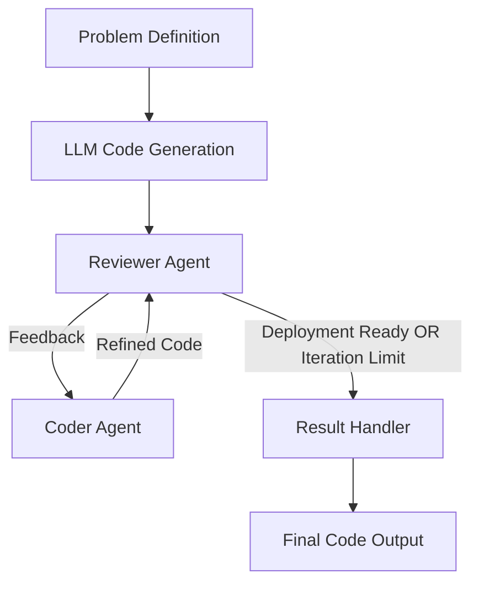

# Multi-Agent Code Reviewer with GPT & LangGraph

This project implements a **multi-agent code reviewer system** using [LangGraph](https://github.com/langchain-ai/langgraph) and GPT-based LLMs. The system mimics a real-world software development workflow where code is generated, reviewed, refined iteratively, and finally marked as deployment-ready.

---

## 🚀 Features
- Multi-agent workflow for automated code review.
- Reviewer agent provides structured feedback on correctness, readability, security, and performance.
- Coder agent refines the code iteratively based on reviewer feedback.
- Stopping criteria based on either:
  - Positive deployment-ready classification.
  - Maximum iteration limit.
- End-to-end orchestration with LangGraph’s workflow execution model.

---

## 🛠️ Workflow
The project defines three primary agents:

1. **Reviewer Agent (`handle_reviewer`)**
   - Reviews the generated code.
   - Provides structured feedback in natural language.
   - Passes results to the next decision node.

2. **Coder Agent (`handle_coder`)**
   - Takes reviewer feedback and improves the code.
   - Sends the refined code back to the reviewer.

3. **Result Handler (`handle_result`)**
   - Collects the final code once it is marked as deployment-ready or iteration limit is reached.
   - Marks the workflow as completed.

---

## ⚙️ Execution Flow
1. Start with problem definition (e.g., *generate code for training a regression ML model*).
2. Initial code is generated by the LLM.
3. Code is passed to the Reviewer Agent for feedback.
4. If not deployment-ready and iteration limit not reached → Reviewer sends it to Coder.
5. Coder refines the code and sends it back to Reviewer.
6. Loop continues until:
   - Reviewer deems code "deployment-ready", or
   - Iterations exceed the threshold.
7. Final code is collected and output through the Result Handler.

---

## 📂 File Structure


---

## 🔧 Installation & Setup
Clone the repo and install dependencies:
```bash
git clone https://github.com/shawn2030/multi-agent-code-reviewer-gpt-langgraph.git
cd multi-agent-code-reviewer-gpt-langgraph
pip install -r requirements.txt
```


